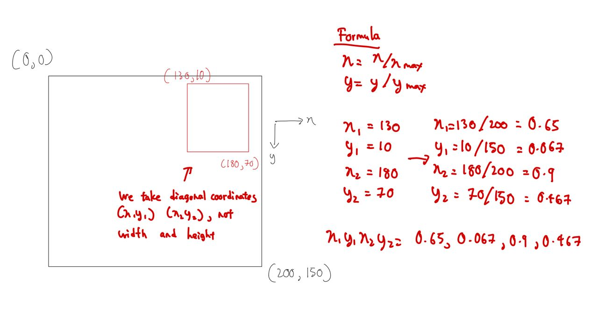

# dump

Efficient YOLOv8 inference + Face recognition using onnx runtime

## 📝 System Design

- `npy files` </br>
There is a list of `.npy` files in the system. These `.npy` files consist of the embeddings of blurred or unrecognizable faces that previous FYP students have identified. These embeddings can slightly reduce the likelihood of the system misidentifying all blurry faces as a certain student's identity.

- `cloudSyncExecute.sh` </br>
This bash script execute the cloud syncing the log files from the local PC to the Google Drive.

- `multi_track.py` </br>
This code is to run the multi-tracking of the objects in the video streams.

- `multi_detect.py` </br>
This code is to run detection across all video streams.

- `source.streams` </br>
This file lists down all video sources (one for each line). The video sources could be video files or rtsp links.

- `geofencing.streams` </br>
This file lists down all geofencing windows (one for each line) in normalized x1y1x2y2 format.

- `register` </br>
To store the faces of all users registered to the database.

## ⌛ Setup

### Setting up the dependencies and environments

Conda environment
```bash
conda create --name new python=3.8.10 -y
conda activate new

git clone https://github.com/yjwong1999/new.git
cd new
```

Install dependencies
```bash
pip3 install torch torchvision torchaudio
pip install ultralytics==8.1.24
pip install pip install pafy==0.5.5
pip install youtube-dl==2021.12.17

pip install scikit-learn==1.3.2
pip install loguru==0.7.2
pip install gdown==4.6.1
pip install ftfy==6.1.1
pip install regex==2023.6.3
pip install filterpy==1.4.5
pip install lapx==0.5.4
pip install onnxruntime-gpu --extra-index-url https://aiinfra.pkgs.visualstudio.com/PublicPackages/_packaging/onnxruntime-cuda-12/pypi/simple/
pip install onnx==1.15.0

pip3 install google-api-python-client==2.111.0
pip3 install gspread==5.12.2
pip3 install oauth2client==4.1.3
```

Install curl if you haven't already
```bash
sudo snap install curl
```

### Get the pretrained models
```bash
curl -L -o "yolov8m_face.pt" "https://www.dropbox.com/scl/fi/f40lcj4pyushbrylrbptt/yolov8m_face.pt?rlkey=83b5timdj39ij7j87irpisaua&st=h2zavfx5&dl=0"
```

```bash
curl -L -o "backbone_90000_vggface2.onnx" "https://www.dropbox.com/scl/fi/ho9xa74ri1vb2tuepe271/backbone_90000_vggface2.onnx?rlkey=vmitga1ecpnv051r1m0p0mpsw&st=aulfs3j4&dl=0"
```


### Find port number connected to camera
```bash
python3 find_port.py
```

### If you are doing multi-stream
```
1. List all the sources in source.streams
2. If you are doing tracking + geofencing, list the geofencing roi xyxy in geofencing.streams
```

### Install VLC player to simulate rtsp streaming
```bash
sudo snap install vlc
```

### Setup the source.streams file
```
<each line is one video source or rtsp streams link>
...
```


### Setup the geofencing.streams
Each line should represent the corresponding geofencing zone for the video source in the `source/streams` file. The geofencing format should be <x1,y1,x2,y2> in normalized format (in 0 to 1 range), WITHOUT SPACING. Example of geofencing format is shown below:
 </br>
Hence, for the above geofencing zone, we should write
```
0.65,0.067,0.9,0.467
... (if got other geofencing zone, each per line)
```

## 💻 Run the codes!

### Detection
Single stream detection
```bash
python3 single_detect.py --webcam
python3 single_detect.py --camera 0
python3 single_detect.py --video-file sample_video.mp4
python3 single_detect.py --rtsp "rtsp://192.168.1.136:8554/"
python3 single_detect.py --youtube "http://www.youtube.com/watch?v=q0kPBRIPm6o"
```

Multi stream detection
```bash
python3 multi_detect.py
```

### Tracking
Single stream tracking
```bash
# Example (without geofencing)
python3 single_track.py --webcam
python3 single_track.py --camera 0
python3 single_track.py --video-file sample_video.mp4
python3 single_track.py --rtsp "rtsp://192.168.1.136:8554/"
python3 single_track.py --youtube "http://www.youtube.com/watch?v=q0kPBRIPm6o"

# Example (with geofencing)
python3 single_track.py -video-file sample_video.mp4 --roi-xyxy 0.6,0.4,0.9,0.8
```

Multi stream tracking
```bash
# without geofencing
python3 multi_track.py

# with geofencing
python3 multi_track.py --geofencing
```

To enable face recognition (fr) to tracking, just add `--fr`
```bash
# for multi track
python3 multi_track.py --fr
python3 multi_track.py --geofencing --fr
```

## ⁉️ Known Issue(s)

### 1. ONNXRuntimeError ... Failed to create CUDAExecutionProvider

This error indicates that something is wrong with the ONNX Runtime. For context, we use the ONNX GPU runtime to speed up some parts of our pipeline. When this error occurs, it means that the ONNX Runtime cannot access our GPU. This could indicate either a GPU problem or an ONNX Runtime problem. </br>

Generally, we suggest reinstalling CUDA to `12.6` or `12.2`, followed by reinstalling the ONNX Runtime using the following commands:

```
pip uninstall onnxruntime-gpu
pip install onnxruntime-gpu==1.17.0 --index-url=https://pkgs.dev.azure.com/onnxruntime/onnxruntime/_packaging/onnxruntime-cuda-12/pypi/simple
```

If this doesn't work, then try the following commands:

```
pip uninstall onnxruntime-gpu
pip install onnxruntime-gpu --extra-index-url https://aiinfra.pkgs.visualstudio.com/PublicPackages/_packaging/onnxruntime-cuda-12/pypi/simple/
```

Note that this is an iterative debugging process. If these steps still do not work, please refer to [onnxruntime documentation](https://onnxruntime.ai/docs/get-started/with-python.html) for the most up-to-date installation process. Warning: Newer steps do not guarantee that things will work, because the pipeline is based on the current interdependent components (dependencies). Therefore, please follow the steps above first, as these steps are more well-studied.

Else, please downgrade CUDA to `11.X`, then follow the onnx-runtime installation for cuda 11.X versions.


### 2. Train your own custom Face recognition model
We used our [code](https://github.com/yjwong1999/Yolov5_DeepSort_Face) to train a custom face recognition model on SurvFace dataset, and export it to onnx. Generally, I believe you can use any model, and just export it to onnx, then use it here.

## TODO
- [ ] cannot play youtube yet
- [ ] drive handling fails for multiple source
- [ ] no error warning when the video source is not available, not sure this will happen for other source types onot
- [ ] the dummy handler in multi_track.py will post() today, should post tmr only


## Acknowledgement
1. ultralytics official repo [[ref]](https://github.com/ultralytics/ultralytics)
2. tips for effecient single-stream detection (multithread, resize frame, skipping frame) [[ref]](https://blog.stackademic.com/step-by-step-to-surveillance-innovation-pedestrian-detection-with-yolov8-and-python-opencv-dbada14ca4e9)
3. multi-thread for multi-stream detection [[ref]](https://ultralytics.medium.com/object-tracking-across-multiple-streams-using-ultralytics-yolov8-7934618ddd2)
4. Tracking with Ultralytics YOLO (how to handle the results) [[ref]](https://docs.ultralytics.com/modes/track/#plotting-tracks-over-time)

## Cite this repository
```
@INPROCEEDINGS{10174362,
  author={Wong, Yi Jie and Huang Lee, Kian and Tham, Mau-Luen and Kwan, Ban-Hoe},
  booktitle={2023 IEEE World AI IoT Congress (AIIoT)}, 
  title={Multi-Camera Face Detection and Recognition in Unconstrained Environment}, 
  year={2023},
  volume={},
  number={},
  pages={0548-0553},
  doi={10.1109/AIIoT58121.2023.10174362}}
```
